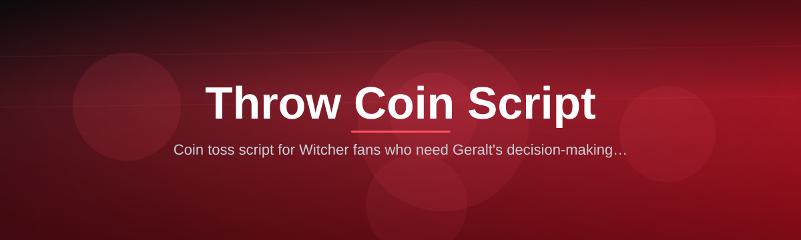
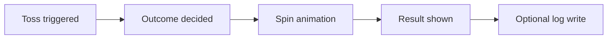

# witcher-coin-toss

*A tiny coin-toss script for people who want Geralt's decision-making ritual without opening a game.*

## What this is

**TL;DR:** witcher-coin-toss is a standalone throw-a-coin script for Windows, inspired by the coin-toss gesture from The Witcher, built for quick yes/no decisions and stream overlays — not a game, not a mod, not a save editor.

This project answers a narrow, specific need: sometimes you want a coin flip that *feels* like an event instead of a `Math.random() > 0.5` one-liner buried in a terminal. witcher-coin-toss gives you a small executable that plays a short toss animation and sound, then lands on heads or tails, with the visual language borrowed from the games' coin-toss ritual. It's meant to sit on your desktop and get double-clicked, not to be integrated into a codebase.

The second thing to understand is scope. There is no dice engine, no gambling logic, no in-game currency, and no connection to CD Projekt's actual game files. It reads no save data and writes nothing back into any Witcher installation. It's a self-contained novelty tool — the kind of thing you'd use to settle "who buys coffee" with a bit more flair than flipping a real coin, or to add a fun beat to a stream between segments.

  

The button above opens the project's landing page, where you can download the current build.

## Who it is for

- **Streamers** who want a quick, visual randomizer between segments instead of a plain overlay text popup.
- **Tabletop and D&D groups** looking for a lightweight "decide who goes first" tool that isn't a dedicated dice app.
- **Witcher fans** who just like the aesthetic and want it as a desktop toy.
- **Small dev teams** who want a fun, low-stakes way to assign tasks ("loser writes the changelog").
- **Content editors** who need a short, royalty-free-feeling coin-flip clip for videos.

## What you can do

- **Trigger a single toss** with one click or a keyboard shortcut, no menus required.
- **See a short animation** of the coin spinning before it settles, instead of an instant result.
- **Hear an audio cue** on landing, so it works even if you glance away from the screen.
- **Choose heads or tails skins** from a small built-in set (default coin, alternate coin face).
- **Run it standalone** — no installer wizard, no background service, no account.
- **Keep a simple result log** in a local text file if you want a history of past tosses.
- **Resize the toss window** to fit an overlay scene for streaming software.
- **Use it fully offline** — the script never phones home or checks for updates on launch.

## Getting started

1. Open the landing page using the download button on this page.
2. Download the latest Windows build listed there.
3. Extract the folder to any location you like (Desktop, Downloads, wherever).
4. Double-click the executable — no setup screen, it opens straight into the toss view.
5. Press the toss button or hotkey to flip the coin.

## Requirements

- Windows 10 or Windows 11 (64-bit).
- No .NET, Python, or Node toolchain needed — the build is standalone.
- No installation step; it runs directly from its folder.
- Roughly 50 MB of free disk space for the app and its assets.

## How it works

**TL;DR:** press toss → coin spins → physics-style settle → result shown → optional log write.

The script keeps a deliberately short pipeline so the "feel" of the toss stays snappy:

1. A toss request is triggered (click or hotkey).
2. A random outcome is generated internally before the animation starts, so the visual never "cheats" toward a result.
3. The coin animation plays for a fixed short duration, spinning down toward the pre-decided face.
4. The result is displayed on screen along with the landing sound.
5. If logging is enabled, the outcome and timestamp are appended to a local text file.

## FAQ

**Is this an official Witcher product?**
No. It's a fan-made novelty script inspired by the coin-toss gesture, unrelated to CD Projekt Red.

**Does the coin toss use real randomness or is it rigged toward one side?**
The outcome is generated with a standard random function before the animation plays, with no bias built in.

**Can I use this on stream without copyright issues?**
The visuals and sounds included are original assets made for this project, so they're safe to show on stream.

**Does it need internet access to work?**
No. Once downloaded, it runs fully offline with no update checks or network calls.

**Can I change the coin design?**
Yes, within the built-in alternate skin option; there's no external asset-pack system yet.

## Troubleshooting

- **The app won't open at all.** Make sure you extracted the full folder rather than running the executable from inside a zip archive.
- **No sound on toss.** Check that your system's default audio output isn't muted; the script uses the OS default device.
- **Window looks tiny or huge on a high-DPI screen.** Try toggling Windows display scaling for the executable via its Properties > Compatibility tab.
- **Log file isn't updating.** Confirm the folder isn't set to read-only, since the log writes a local text file next to the app.

## License

Released under the [MIT License](LICENSE). It is provided as-is, with no warranty; use it for fun, streams, or decision-making at your own discretion.

  

